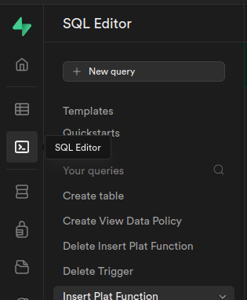
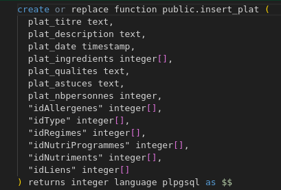
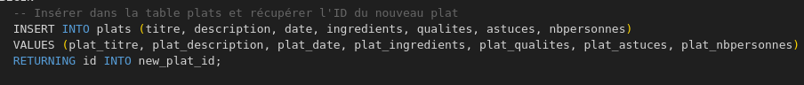
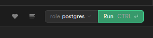
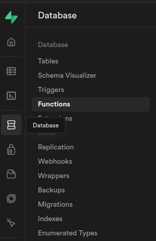
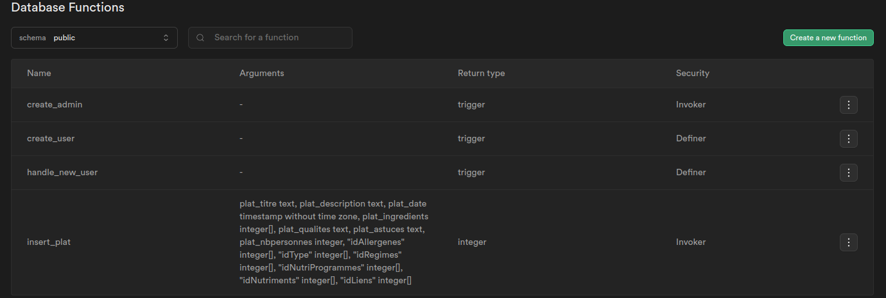
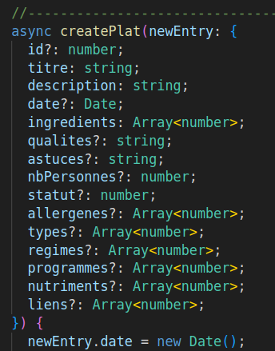
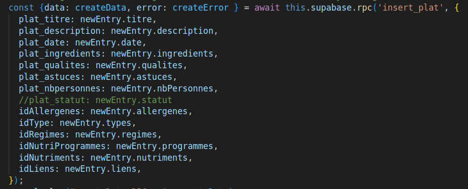
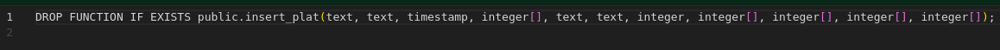
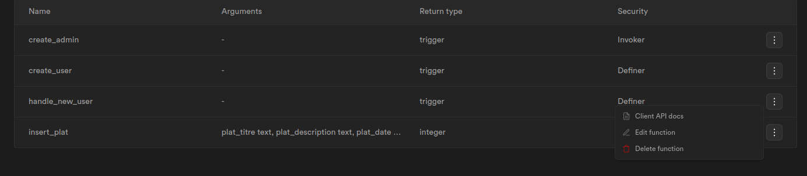

# AdminTiaki

This project was generated with [Angular CLI](https://github.com/angular/angular-cli) version 16.0.0.

## Development server

Run `ng serve` for a dev server. Navigate to `http://localhost:4200/`. The application will automatically reload if you change any of the source files.

## Code scaffolding

Run `ng generate component component-name` to generate a new component. You can also use `ng generate directive|pipe|service|class|guard|interface|enum|module`.

## Build

Run `ng build` to build the project. The build artifacts will be stored in the `dist/` directory.

## Running unit tests

Run `ng test` to execute the unit tests via [Karma](https://karma-runner.github.io).

## Running end-to-end tests

Run `ng e2e` to execute the end-to-end tests via a platform of your choice. To use this command, you need to first add a package that implements end-to-end testing capabilities.

## Further help

To get more help on the Angular CLI use `ng help` or go check out the [Angular CLI Overview and Command Reference](https://angular.io/cli) page.

## Liens tutoriels & documentations
Vidéo pour créer un guard sur Angular 16
https://www.youtube.com/watch?v=tFsCynatnlo

Vidéo pour se connecter en utilisant le systéme d'authentification de Supabase 
https://www.youtube.com/watch?v=hPI8OegHPYc

## Supabase fonction SQL

### Création de la fonction sur Supabase

Depuis l'interface de Supabase se rendre sur l'éditeur de code SQL et cliquer sur New query pour créer une nouvelle requête SQL

Créer la fonction comme sur l'exemple ci-dessous en lui donnant un nom précéder de la mention public

Créer des paramètres adéquats à la fonction - Return en language plpsql - Supabase utilise PostgreSQL

Ajouter le code SQL nécessaire entre les balises BEGIN et END

Pour exécuter la fonction cliquer sur le bouton RUN, le résultat est visible dans la console et permet de gérer d'éventuelles erreurs

Pour accéder aux fonctions depuis l’interface de supabase il suffit de cliquer sur l’onglet Database puis sur Functions

Toutes les fonctions existantes sont lister sur cette interface, en cliquant sur l'icône à leurs droites on peux voir le code SQL contenue

Pour utiliser la fonction depuis le code créer une méthode reprenant les paramètres de la fonction SQL

Dans notre méthode Angular faire appelle à la fonction créer sur supabase avec **.rpc** suivi du nom de la fonction SQL

Adapter ensuite les valeurs attendues

En cas d'erreur il est possible de supprimer la fonction soit avec un code SQL soit depuis l'interface Supabase

Exemple avec un code SQL

Exemple depuis l'interface Supabase

